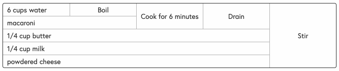

# Recipe Parser

Write recipes in a Markdown-like syntax, and display them as a flowchart, [Cooking for Engineers](http://www.cookingforengineers.com) style.

Turn this:
```
Kraft Dinner (Mac & Cheese)
  [1] Boil: 6 cups water
  [2] Cook for 6 minutes: #1, macaroni
  [3] Drain: #2
  [4] Stir: 
    #3, 
    1/4 cup butter, 
    1/4 cup milk, 
    powdered cheese
```

into this:




# RecipeMD syntax

## Title
Add the title of your recipe as the first line of your recipe file.

## Steps
A step is an individual action in the recipe. Declare a step using square brackets with a number (note: steps must be declared in order). Reference another step in other steps using the `#` character followed by the step number.

A step is made up of 2 parts, the `verb`, or action word, and a list of `ingredients` or previous `steps`.

**Example:**
```
[2] Cook for 6 minutes: #1, macaroni
```

## Verbs
Include a verb as the first part of every step. End the verb text with a colon `:`. In the above example `Cook for 6 minutes` is the verb.

## Ingredients
Ingredients are the subject of the step, what you're taking the action on. Ingredients can be new ingredients, or references to past steps. In the above example, `#1` is a reference to a past step, and `macaroni` is a new ingredient.

## Gotchas
Recipes must end in one step that brings all ingredients together (otherwise the chart will only display one section of the recipe). It's best to think of a recipe like a tree where the final product is the trunk, each ingredient is a leaf, and each step is a branch connecting leaves or smaller branches to the trunk.

# Usage
## Utility Function

Use the utility function to parse a string into an abstract recipe object

**Example:**
```ts
import {parseRecipe} from '@thesonofthomp/recipe-parser'
const recipeString = 
`Kraft Dinner (Mac & Cheese)
  [1] Boil: 6 cups water
  [2] Cook for 6 minutes: #1, macaroni
  [3] Drain: #2
  [4] Stir: 
    #3, 
    1/4 cup butter, 
    1/4 cup milk, 
    powdered cheese
`
const recipeJson = parseRecipe(recipeString)
```

## React component

To render your recipe in a React app, use the `RecipeChart` component.
This component accepts a child string in RecipeMD syntax, or a `json` prop that was returned from `parseRecipe`.

**Example:**

```tsx
import { RecipeChart } from '@thesonofthomp/recipe-parser'

const myRecipe = () => {
  return (
    <RecipeChart>
      Kraft Dinner (Mac & Cheese)
        [1] Boil: 6 cups water
        [2] Cook for 6 minutes: #1, macaroni
        [3] Drain: #2
        [4] Stir: 
          #3, 
          1/4 cup butter, 
          1/4 cup milk, 
          powdered cheese
    </RecipeChart>
  )
}
```